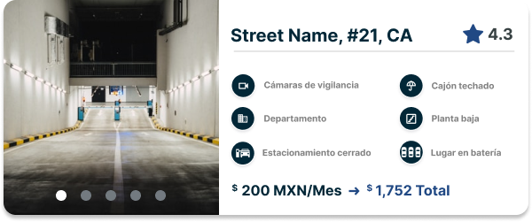
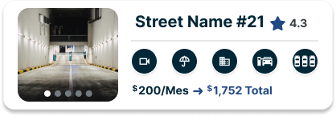

# Getting Started with Create React App

This project was bootstrapped with [Create React App](https://github.com/facebook/create-react-app).

## Available Scripts

In the project directory, you can run:

### `npm start`

Runs the app in the development mode.\
Open [http://localhost:3000](http://localhost:3000) to view it in the browser.

The page will reload if you make edits.\
You will also see any lint errors in the console.

### `npm test`

Launches the test runner in the interactive watch mode.\
See the section about [running tests](https://facebook.github.io/create-react-app/docs/running-tests) for more information.

### `npm run build`

Builds the app for production to the `build` folder.\
It correctly bundles React in production mode and optimizes the build for the best performance.

The build is minified and the filenames include the hashes.\
Your app is ready to be deployed!

See the section about [deployment](https://facebook.github.io/create-react-app/docs/deployment) for more information.

### `npm run eject`

**Note: this is a one-way operation. Once you `eject`, you can’t go back!**

If you aren’t satisfied with the build tool and configuration choices, you can `eject` at any time. This command will remove the single build dependency from your project.

Instead, it will copy all the configuration files and the transitive dependencies (webpack, Babel, ESLint, etc) right into your project so you have full control over them. All of the commands except `eject` will still work, but they will point to the copied scripts so you can tweak them. At this point you’re on your own.

You don’t have to ever use `eject`. The curated feature set is suitable for small and middle deployments, and you shouldn’t feel obligated to use this feature. However we understand that this tool wouldn’t be useful if you couldn’t customize it when you are ready for it.

## Learn More

You can learn more in the [Create React App documentation](https://facebook.github.io/create-react-app/docs/getting-started).

To learn React, check out the [React documentation](https://reactjs.org/).
#� �K�a�l�y�p�t�i�o�-�c�l�i�e�n�t�
�
�

# Kalyptio Fullstack Code Challenge

A garage parking which manages plenty of car spaces needs to develop an app in order to create, delete, list and filter their available parking spaces. Your mission is to build a webapp in order to solve the company's needs for the following use case:

A person is searching for a parking space between the 1st of October and the 30th of April. He/she is prompted with three different options; parking space A in Street A #35, California, CA, parking space B in Street B #27, California, CA, and parking space C in Street C #7, California, CA.
Parking space A will cost 100USD per month, Parking space B will cost 175USD per month, and Parking space C will cost 200USD per month.

The platform will show him/her the spaces available with the following requirements:

## Client requirements description

1. Client solution should be written in Angular +12, Vue +3 or React +17.
2. Web app must consume server app endpoints (Create, list, filter, parking detail page and delete parkings).
3. Web app must be responsive!
4. You can use any UI library like Bootstrap or Material.

We’d expect the following design when listing parkings in desktop (Individual Parking Card): 

We’d expect the following design when listing parkings in mobile (Individual Parking Card): 

Parking Card must show the following info:

1. Address.
2. Amenities.
3. Score.
4. Price.
5. Image Carrousel (You can use any images. Up to 5 per card).
---
